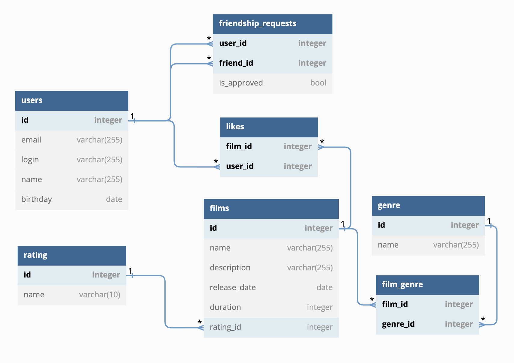

# java-filmorate

Фильмов много — и с каждым годом становится всё больше. Чем их больше, тем больше разных оценок. Чем больше оценок, тем сложнее сделать выбор. Однако не время сдаваться! Здесь находится репозиторий сервиса, который будет работать с фильмами и оценками пользователей, а также возвращать топ-5 фильмов, рекомендованных к просмотру. Теперь ни вам, ни вашим друзьям не придётся долго размышлять, что посмотреть вечером.

## ER-диаграмма сервиса



### Примеры запросов к базе данных

#### Получение всех пользователей
```SQL
SELECT * 
FROM users;
```

#### Получение всех фильмов
```SQL
SELECT * 
FROM films;
```

#### Получение 10 самых популярных фильмов с количеством лайков
```SQL
SELECT f.name,
       COUNT(l.user_id) total_likes
FROM likes l
LEFT JOIN films f ON f.id = l.film_id
GROUP BY f.name
ORDER BY total_likes DESC
LIMIT 10;  
```

#### Получение общих друзей пользователей с id=1 и с id=2
```SQL
(SELECT friend_id friend
 FROM friendship_requests fr1
 WHERE user_id = 1 AND is_approved = 'TRUE'
 UNION 
 SELECT user_id friend
 FROM friendship_requests fr2
 WHERE friend_id = 1 AND is_approved = 'TRUE') 
INTERSECT
 (SELECT friend_id friend
  FROM friendship_requests fr1
  WHERE user_id = 2 AND is_approved = 'TRUE'
  UNION 
  SELECT user_id friend
  FROM friendship_requests fr2
  WHERE friend_id = 2 AND is_approved = 'TRUE')
```